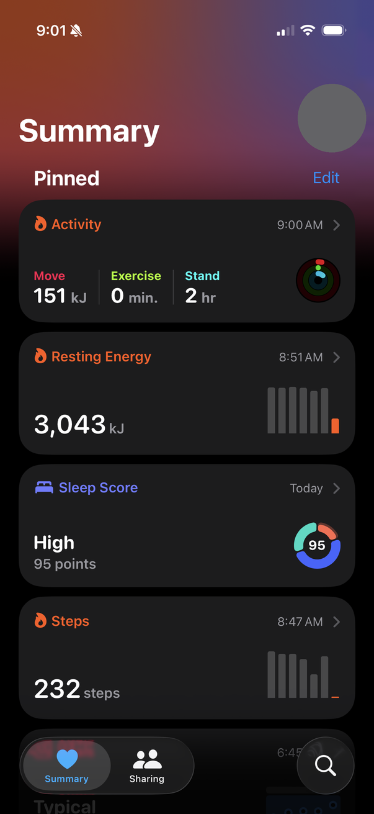
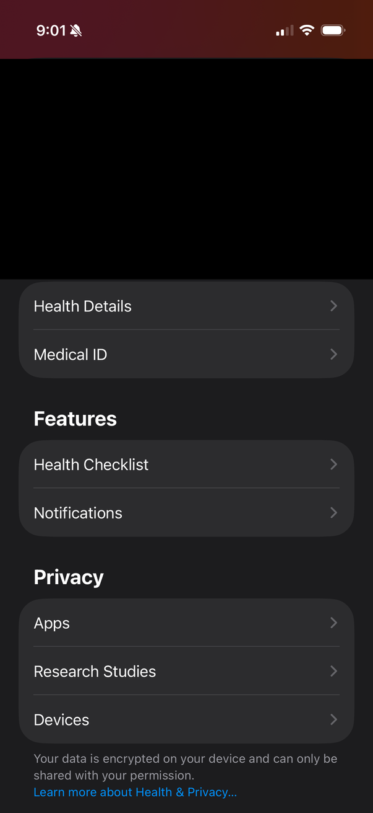
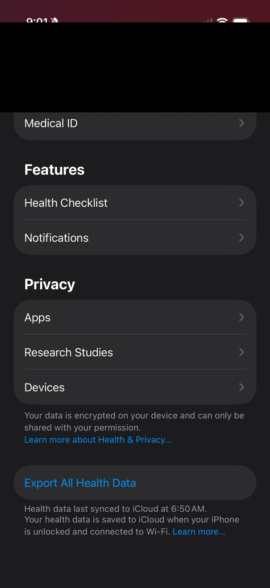
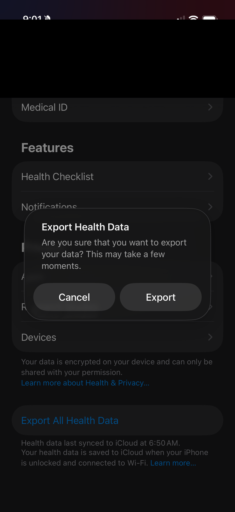
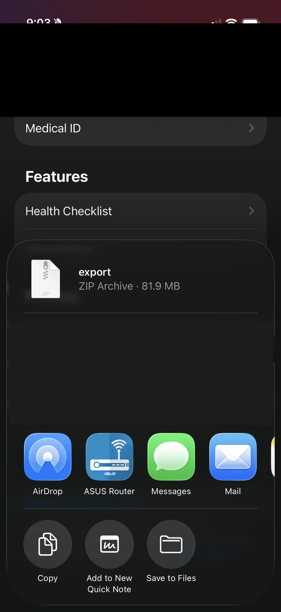
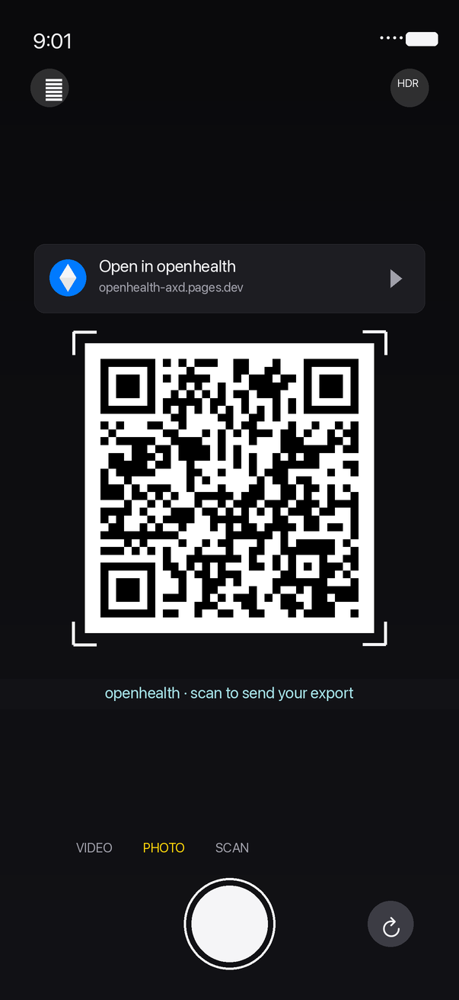

# openhealth

> Chat with your Apple Health data.

Your iPhone has been collecting millions of data points about how you sleep, train, and recover, and they're locked inside a 200 MB `export.xml` nothing will open. `openhealth` turns that export into **seven short markdown files** any LLM can read — so you can paste your actual data into ChatGPT or Claude instead of answering their generic questions with vibes.

No account. No server. No telemetry. The zip never leaves your device.

- **Web app:** drop the zip at [openhealth-axd.pages.dev](https://openhealth-axd.pages.dev)
- **CLI:** `openhealth ~/export.zip -o ./output`
- **Source:** <https://github.com/jonnonz1/openhealth> · **License:** MIT

---

## How to get your Apple Health data

Six taps in the Health app. Nothing leaves your phone until *you* drop the zip here.

<table>
  <tr>
    <td align="center" width="33%">
      <br/>
      <strong>1. Open Health, tap your profile</strong><br/>
      <sub>The avatar in the top-right corner opens your profile.</sub>
    </td>
    <td align="center" width="33%">
      <br/>
      <strong>2. Scroll down past the profile</strong><br/>
      <sub>Past the Features and Privacy sections.</sub>
    </td>
    <td align="center" width="33%">
      <br/>
      <strong>3. Tap <em>Export All Health Data</em></strong><br/>
      <sub>At the very bottom — the only button that packages everything.</sub>
    </td>
  </tr>
  <tr>
    <td align="center" width="33%">
      <br/>
      <strong>4. Confirm the export</strong><br/>
      <sub>30 s – a few minutes for up to 200 MB of data.</sub>
    </td>
    <td align="center" width="33%">
      <br/>
      <strong>5. Tap Save to Files</strong><br/>
      <sub>The zip appears in the share sheet — around 80 MB.</sub>
    </td>
    <td align="center" width="33%">
      <br/>
      <strong>6. Or: scan the desktop QR</strong><br/>
      <sub>Skip Files. Point your iPhone camera at the QR on openhealth — the zip goes phone-to-desktop over WebRTC.</sub>
    </td>
  </tr>
</table>

Then hand the zip to `openhealth` — browser, CLI, or QR handoff — all three run the same parser and nothing is uploaded.

| File | Contains |
|---|---|
| `health_profile.md` | Baselines, data sources, long-term averages, weight history |
| `weekly_summary.md` | Current week + 4-week rolling comparison with week-over-week deltas |
| `workouts.md` | Detailed workout log for the last 4 weeks (HR, duration, distance, energy) |
| `body_composition.md` | Weight trend (6 months), recent readings, weekly nutrition averages |
| `sleep_recovery.md` | Nightly sleep stages, 8-week averages, HRV / resting HR / SpO2 trends |
| `cardio_fitness.md` | Running log (3 months), HR-zone distribution, walking-speed trends |
| `prompt.md` | Ready-to-paste system prompt that frames the other six files as coaching input |

There's also a `--bundle` mode that concatenates all seven into one `openhealth.md` with H1 section breaks.

---

## Privacy

Privacy is the architecture, not a feature.

- Every byte is parsed **inside your browser tab** (or the local CLI). Open DevTools and watch the Network panel: no upload.
- The only backend is a ~100-line Cloudflare Worker used for WebRTC signaling during the optional phone-to-desktop handoff — it sees SDP handshake metadata, never file bytes.
- No analytics on the user. No pageview tracking, no cookies, no third-party scripts. Traffic counts are read from the host's edge logs only.
- Reproducible: clone the repo, build it, diff the output. `pnpm -C packages/web build` produces byte-identical assets to the hosted site.

---

## Install / run

Requires **Node 22+**, **pnpm 9+**, and — for the CLI binary — **[Bun](https://bun.sh)**.

```bash
pnpm install
pnpm test           # 85 tests, covers parser edge cases + byte-for-byte markdown snapshots
pnpm typecheck
```

### CLI

```bash
# Build the single-file native binary
pnpm -C packages/cli build
./packages/cli/bin/openhealth --version

# Typical use
openhealth ~/export.zip -o ./output
openhealth ~/export.zip --bundle -o ./output      # one file instead of seven
openhealth ~/export.zip --clipboard               # bundle straight to clipboard
```

### Web app (local)

```bash
pnpm -C packages/web dev                          # http://localhost:5173
```

---

## Repo layout

```
packages/
├── core/       @openhealth/core       — isomorphic parser, aggregator, writers
├── cli/        @openhealth/cli        — Bun-compiled single-binary CLI
├── web/        openhealth.app         — Vite static site, Web Worker parse off main thread
└── signaling/  @openhealth/signaling  — Cloudflare Worker + Durable Object for QR handoff
fixtures/       — hand-crafted tiny XML inputs + expected markdown snapshots
specs/          — design docs (001 = architecture, 002 = design system)
```

Primary runtime: **Bun** (CLI binary via `bun build --compile`). Node 22+ also supported. Parser tested with a 169 MB / 1 M-record synthetic export — ~5 seconds in Chrome, main-thread heap stays at ~5 MB thanks to Worker isolation.

---

## Deploy your own

**Static site (Cloudflare Pages):**
```bash
VITE_SIGNALING_URL="wss://<your-signaling-worker>.workers.dev" \
  pnpm -C packages/web build
npx wrangler pages deploy packages/web/dist --project-name openhealth
```

**Signaling worker (Cloudflare):**
```bash
cd packages/signaling
npx wrangler login
npx wrangler deploy
```

Alternatively: deploy `packages/web/dist` to any static host (Netlify, Vercel, GitHub Pages). The signaling worker can go anywhere that runs WebSocket handlers with per-session state — Cloudflare Workers + Durable Objects is the smallest-ops option, the relay is ~100 lines.

---

## Contributing

Issues and PRs welcome at <https://github.com/jonnonz1/openhealth>. The project is TDD — every change lands with a test first. Golden rules:

- **No attribution.** Don't add "Generated with X" / "Co-Authored-By" markers anywhere.
- **No telemetry.** The privacy banner on the site is a promise, not marketing.
- **Simple over clever.** Zero deps > few deps > many. `node:util parseArgs` over commander. `saxes` over tree-builders.
- **Fixtures are synthetic.** Never commit a real health export.

See [`CONTRIBUTING.md`](CONTRIBUTING.md) for the long version.

---

## Author

Built by [**John**](https://jonno.nz) — engineer writing about AI, architecture, and tooling at [jonno.nz](https://jonno.nz).

## License

MIT — see [LICENSE](LICENSE).
